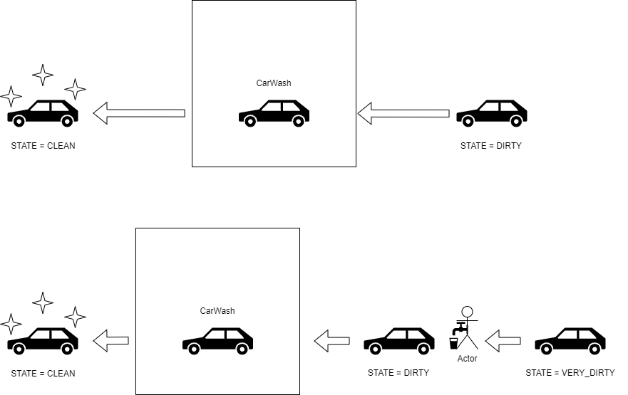

# Carwash

For this exercise you need to create the flow of a carwash. 
In the image below you can find the visualisation for the two flows.

## Functional flows

### Flow One
- A car drives to the car wash.
- The car is dirty and therefor ready to be washed. 
- The car goes into the CarWash and gets cleaned. 
- The car comes out of the CarWash and is clean.

### Flow Two
- A car drives to the car wash.
- The car is very dirty and needs to be pre cleaned first. 
- After the pre cleaning the car is still dirty and ready to be washed. 
- The car goes into the CarWash and gets cleaned.
- The car comes out of the CarWash and is clean.



## Technical flows
- The CarWashService is going to be your orchestration point. 
- The CarWashService creates a CarWash object.
  - ```java
    private CarWash carWash = new CarWash();
  - The CarWash object contains two ArrayLists of the type Car:
    - washedCars
    - toBeWashedCars
- The CarWashService has three methods:
  - ```java
    // The car can only be washed when the STATE is not VERY_DIRTY.
    void washCar(Car car)
  - ```java
    // The car needs to be washed when the STATE is VERY_DIRTY.
    void preCleanCar(Car car)
  - ```java
    // The car is being put into the carwash. The process is started. 
    void rideCarintoCarWash(Car car)


## Assignment
This assignment will not contain any test scenarios. It's all up to you now!
In the main class create an instance of the CarWashService and ride the car into the carwash.
Everytime a Car is being driven into the CarWash, show with console statements that the correct flow is being used.
Think about the design of the Car object. We are not interested in the name, only the state.

```java
public enum State {
  CLEAN, VERY_DIRTY, DIRTY;
}
```

For example: 
```java
Drive the car into the CarWash.
Car has state VERY_DIRTY, we have to pre clean it first. 
Car is being pre cleaned.
Car is being washed.
Car is clean.

